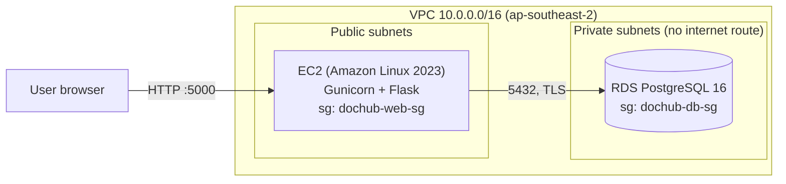
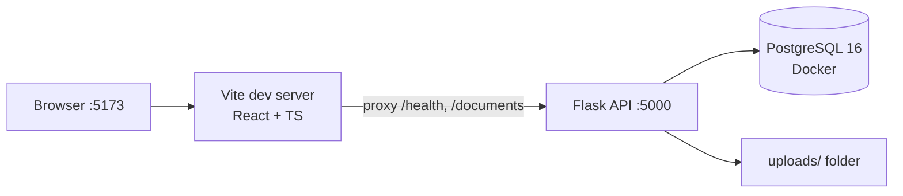

# DocHub: Migrating & Modernising a Legacy App on AWS

DocHub is a small internal document portal (upload, search, download, delete) built as a realistic "legacy" application, then **migrated to AWS and modernised step by step**, the way an AWS Professional Services engagement would approach it: rehost first, then automate, replatform, add CI/CD, and introduce generative AI.

> **Status:** Phase 1 (lift-and-shift to EC2 + RDS) complete. Phase 2 (Terraform) in progress.

---

## Features

- 📄 Upload documents (PDF, TXT, MD, DOCX) with title and description
- 🔍 Live, debounced search by title
- ⬇️ Download and 🗑 delete (with inline confirmation)
- 🟢 Live health indicator that checks API and database connectivity
- Loading, empty and error states throughout

## Architecture

### Current: Phase 1, rehosted on AWS



### Local development



## Tech stack

| Layer | Technology |
|---|---|
| Front end | React, TypeScript, Vite |
| API | Python 3.11, Flask, Gunicorn |
| Database | PostgreSQL 16 (Docker locally, Amazon RDS in AWS) |
| Cloud | Amazon VPC, EC2, RDS, Security Groups, IAM Identity Center |
| Tooling | Git, Docker, AWS CLI, Terraform (Phase 2) |

## Security & design decisions

- **Database isolated in private subnets.** RDS has no public access and no internet route.
- **Security-group referencing.** The database only accepts port 5432 from the web tier's security group, not from IP ranges.
- **Encryption.** TLS enforced for database connections (`sslmode=require`); RDS storage encrypted at rest with KMS.
- **Least-privilege access.** IAM Identity Center with short-lived credentials; no IAM users or long-lived access keys.
- **SQL injection protection.** All queries are parameterised.
- **Safe file handling.** `secure_filename`, UUID-prefixed storage names, extension allow-list, 10 MB upload limit (HTTP 413).
- **Config outside code.** Settings come from environment variables (`.env` locally); no secrets in the repository.
- **Health checks.** `/health` verifies database connectivity and returns `503` when unavailable, ready for load balancer health checks.

## API reference

| Method | Endpoint | Description | Success |
|---|---|---|---|
| GET | `/health` | API + database status | `200` / `503` |
| GET | `/documents?q=` | List documents, optional title search | `200` |
| POST | `/documents` | Create a document record (JSON) | `201` |
| POST | `/documents/upload` | Upload a file (multipart form) | `201` |
| GET | `/documents/<id>/download` | Download the file | `200` / `404` |
| DELETE | `/documents/<id>` | Delete record and stored file | `204` / `404` |

## Running locally

**Prerequisites:** Python 3.11, Node.js LTS, Docker Desktop

```bash
# 1. Database
docker run --name dochub-db -e POSTGRES_USER=dochub -e POSTGRES_PASSWORD=localdevpass \
  -e POSTGRES_DB=dochub -p 5432:5432 -d postgres:16
docker exec -i dochub-db psql -U dochub -d dochub < schema.sql

# 2. API
python -m venv .venv
source .venv/bin/activate          # Windows: .\.venv\Scripts\Activate.ps1
pip install -r requirements.txt
cp .env.example .env               # then set DATABASE_URL
python app.py                      # http://127.0.0.1:5000

# 3. Front end (new terminal)
cd frontend
npm install
npm run dev                        # http://localhost:5173
```

## Roadmap

| Phase | Goal | AWS services | Status |
|---|---|---|---|
| 1. Rehost | Lift-and-shift the app as-is | VPC, EC2, RDS, Security Groups | ✅ Done |
| 2. Infrastructure as Code | Rebuild the whole environment with one command | Terraform | 🔄 In progress |
| 3. Replatform | Containerise the API; files to object storage; static front end | ECS Fargate, ECR, ALB, S3, CloudFront | ⏳ Planned |
| 4. CI/CD & operations | Automated deploys, monitoring, secrets | GitHub Actions, CloudWatch, Secrets Manager | ⏳ Planned |
| 5. Generative AI | "Chat with your documents" (RAG) | Amazon Bedrock Knowledge Bases, Lambda, API Gateway | ⏳ Planned |

## Cost awareness

The environment is designed to be cheap to run and easy to tear down:

- No NAT Gateway in Phase 1 (avoids roughly US$30+/month)
- `t3.micro` EC2 and `db.t4g.micro` RDS, Single-AZ for development
- Resources are stopped or destroyed between work sessions; AWS Budgets alerts are configured

## Screenshots

_Add screenshots here: the DocHub UI, `/health` served from EC2, the VPC resource map, and RDS showing "Publicly accessible: No"._

## Author

**Aravind Aparajith Karthikeyan**: [LinkedIn](https://linkedin.com/in/aravindaparajith) · [GitHub](https://github.com/aravindaparajith)
